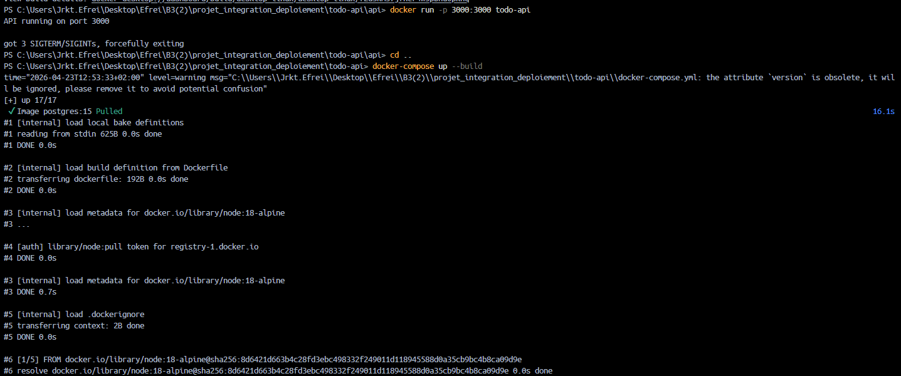
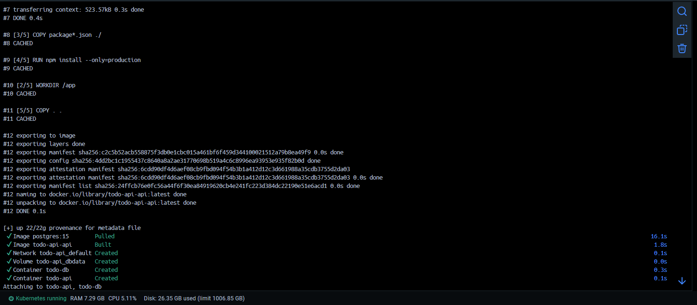
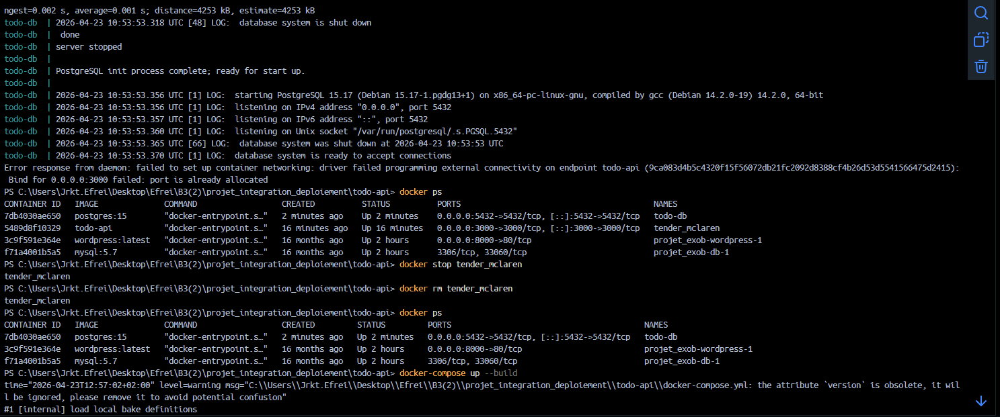
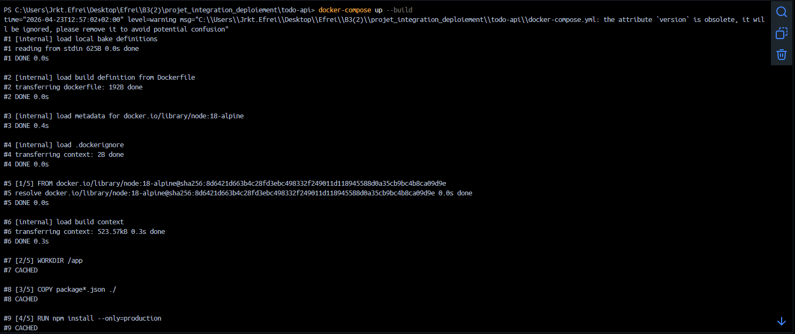
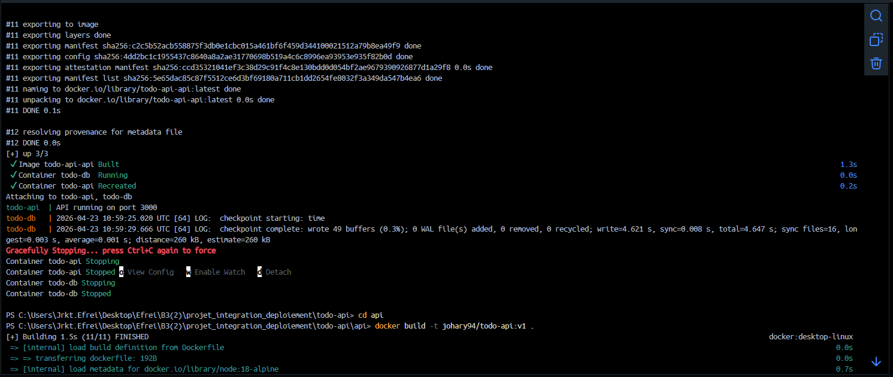
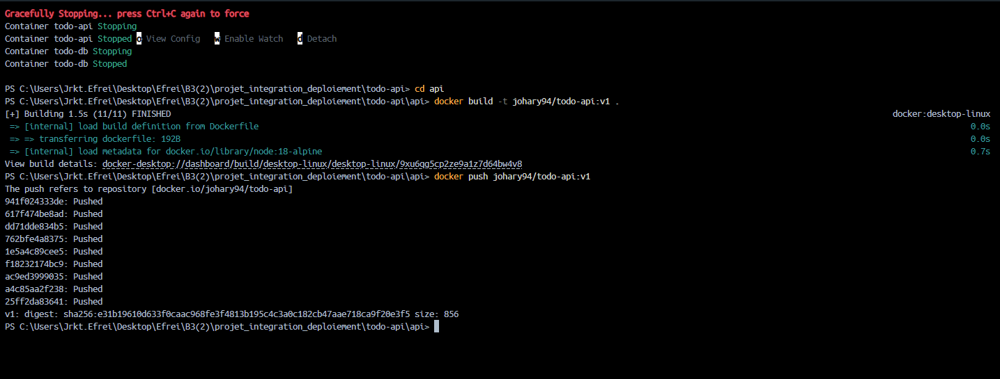
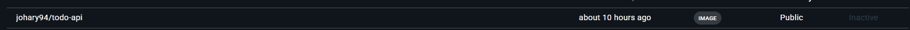
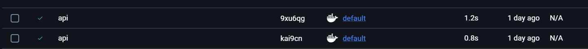
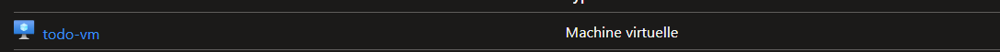
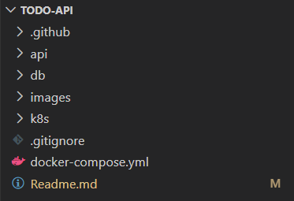

## projet

Ce projet a pour objectif d’automatiser le déploiement d’une application web afin de réduire les erreurs humaines et d’améliorer la rapidité des mises en production. j’ai choisi le deuxième sujet, qui consiste à mettre en place et déployer deux services distincts :

une API web et une base de données.

## Objectifs :

- Conteneuriser une application avec Docker  
- Orchestrer plusieurs services avec Docker Compose  
- Déployer l’application dans un cluster Kubernetes  
- Héberger le cluster dans une VM cloud (Azure)  
- Préparer un pipeline CI/CD automatisé  
- Gérer les variables d’environnement et les secrets  

Technologies utilisées dans le projet :

### 1. Langages & Frameworks
- **Node.js** — environnement d’exécution JavaScript côté serveur  
- **Express.js** — framework minimaliste pour créer une API REST  
- **SQL** — langage utilisé pour manipuler la base de données PostgreSQL  

### 2. Base de données
- **PostgreSQL** — base de données relationnelle utilisée pour stocker les tâches  
- **init.sql** — script d’initialisation pour créer la table `tasks`  

### 3. Conteneurisation
- **Docker** — conteneurisation de l’API et de PostgreSQL  
- **Dockerfile** — fichier de configuration pour construire l’image de l’API  
- **Docker Compose** — orchestration locale des services (API + base de données)

### 4. Orchestration & Déploiement
- **Kubernetes (K8s)** — orchestration des conteneurs en environnement de production  
- **kubectl** — outil en ligne de commande pour gérer le cluster  
- **Pods / Services / Deployments** — ressources Kubernetes utilisées pour déployer l’application  

### 5. Cloud & Infrastructure
- **Microsoft Azure** — hébergement de la machine virtuelle  
- **SSH** — protocole de connexion sécurisée à la VM 

#### Dockerisation :


















#### Création de la VM azure :



#### déploiement de la VM et Orchestration avec Kubernetes :

### Architecture du projet :



### 1. api/ — Service API Node.js
Contient tout le code du backend :

- **server.js** : point d’entrée de l’application  
- **package.json** : dépendances (Express, pg, Jest…)  
- **Dockerfile** : construction de l’image Docker  
- **tests/** : tests unitaires (healthcheck, endpoints…)  

---

### 2. db/ — Base de données PostgreSQL
Contient :

- **init.sql** : script SQL pour créer la table `tasks`  

Ce script est utilisé :
- automatiquement en local via Docker Compose  
- manuellement dans Kubernetes via `kubectl cp` + `psql -f`  

---

### 3. k8s/ — Déploiement Kubernetes
Contient tous les manifests YAML nécessaires au déploiement :

- **deployment-api.yaml** : déploiement de l’API  
- **service-api.yaml** : exposition via NodePort (30080)  
- **deployment-db.yaml** : déploiement PostgreSQL  
- **service-db.yaml** : service interne (ClusterIP)  
- **namespace.yaml** : namespace `todo-namespace`  

---

### 4. docker-compose.yml — Orchestration locale
Permet de lancer l’API + PostgreSQL en local :

```bash
docker-compose up --build

---
