## projet

Ce projet a pour objectif d’automatiser le déploiement d’une application web afin de réduire les erreurs humaines et d’améliorer la rapidité des mises en production. j’ai choisi le deuxième sujet, qui consiste à mettre en place et déployer deux services distincts :

une API web et une base de données.

## Objectifs :

- Conteneuriser une application avec Docker  
- Orchestrer plusieurs services avec Docker Compose  
- Déployer l’application dans un cluster Kubernetes  
- Héberger le cluster dans une VM cloud (Azure)  
- Préparer un pipeline CI/CD automatisé  
- Gérer les variables d’environnement et les secrets  

Technologies utilisées dans le projet :

### 1. Langages & Frameworks
- **Node.js** — environnement d’exécution JavaScript côté serveur  
- **Express.js** — framework minimaliste pour créer une API REST  
- **SQL** — langage utilisé pour manipuler la base de données PostgreSQL  

### 2. Base de données
- **PostgreSQL** — base de données relationnelle utilisée pour stocker les tâches  
- **init.sql** — script d’initialisation pour créer la table `tasks`  

### 3. Conteneurisation
- **Docker** — conteneurisation de l’API et de PostgreSQL  
- **Dockerfile** — fichier de configuration pour construire l’image de l’API  
- **Docker Compose** — orchestration locale des services (API + base de données)

### 4. Orchestration & Déploiement
- **Kubernetes (K8s)** — orchestration des conteneurs en environnement de production  
- **kubectl** — outil en ligne de commande pour gérer le cluster  
- **Pods / Services / Deployments** — ressources Kubernetes utilisées pour déployer l’application  

### 5. Cloud & Infrastructure
- **Microsoft Azure** — hébergement de la machine virtuelle  
- **SSH** — protocole de connexion sécurisée à la VM 

#### Dockerisation :


#### Création de la VM azure + clé SSH :


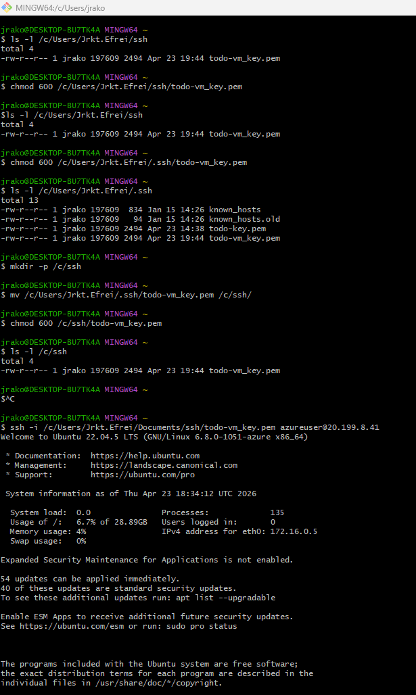


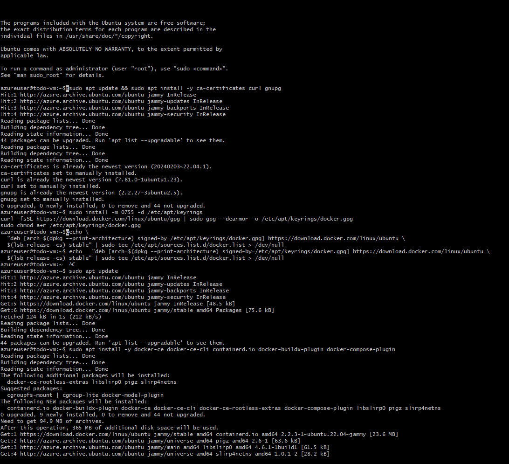


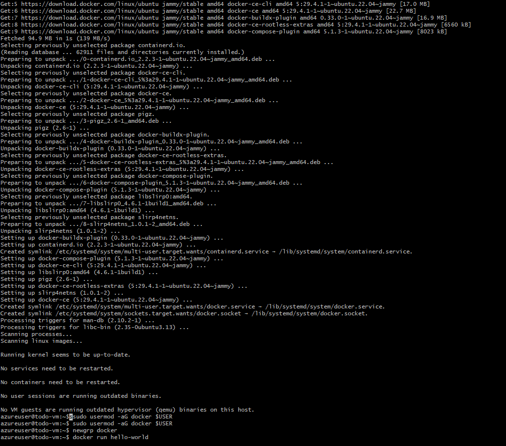


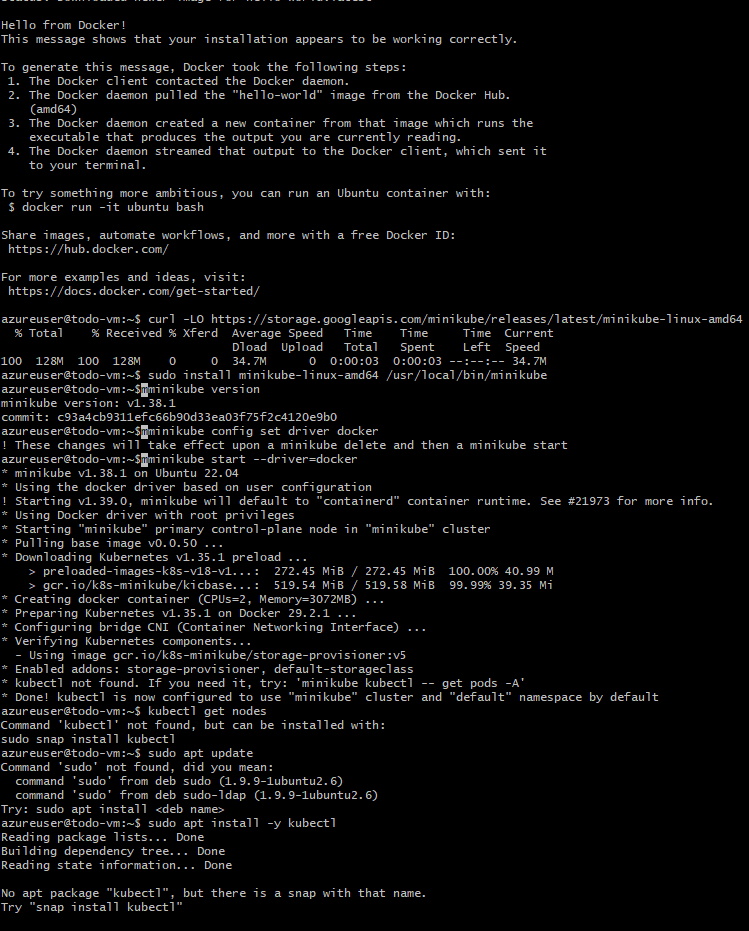


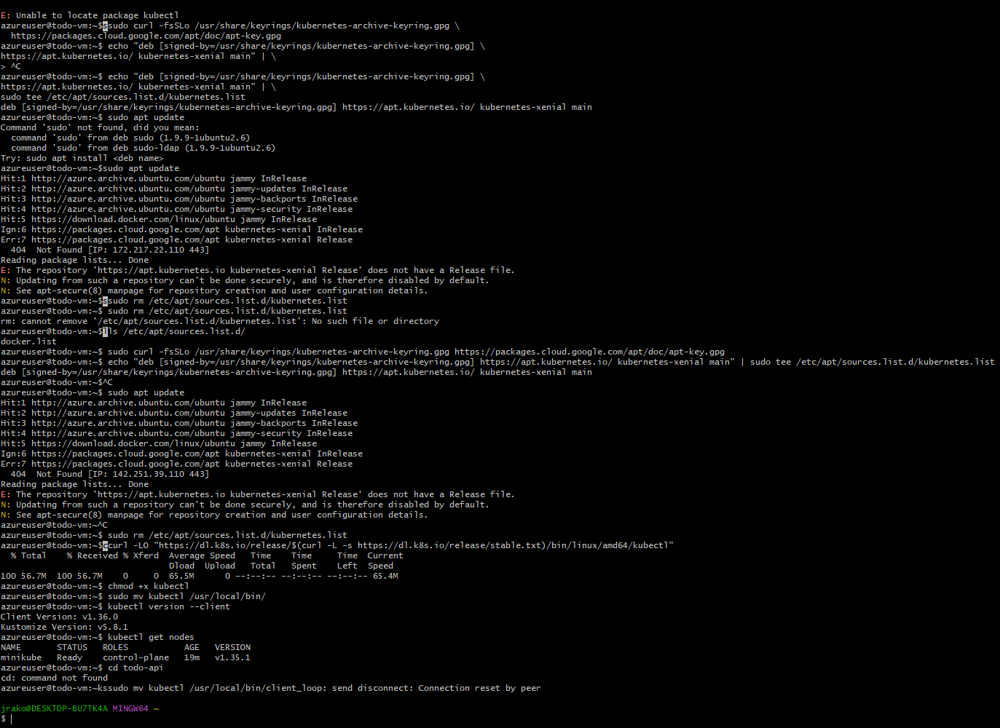


- Pour cette partie, j’ai créé une machine virtuelle Ubuntu 22.04 sur Microsoft Azure. 
J’ai rencontré une difficulté lors de la connexion SSH : la clé privée n’avait pas 
les bonnes permissions. Après avoir déplacé la clé dans un dossier dédié et appliqué 
chmod 600, la connexion SSH a fonctionné.

- Une fois connecté à la VM, j’ai installé Docker et Docker Compose en ajoutant le 
dépôt officiel Docker, puis en installant les paquets docker-ce, docker-cli, 
containerd.io et docker-compose-plugin.

- J’ai ensuite installé Kubernetes local via Minikube. Après avoir téléchargé le 
binaire, je l’ai installé dans /usr/local/bin puis j’ai démarré un cluster Kubernetes 
avec Docker comme driver. La commande `kubectl get nodes` a confirmé que le cluster 
était opérationnel.

#### déploiement de la VM et Orchestration avec Kubernetes :

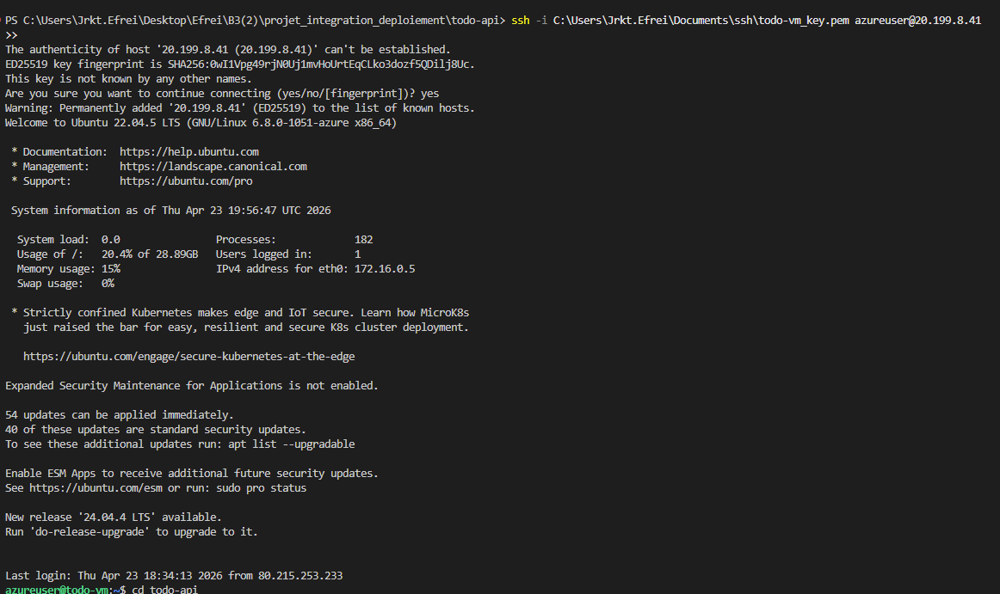

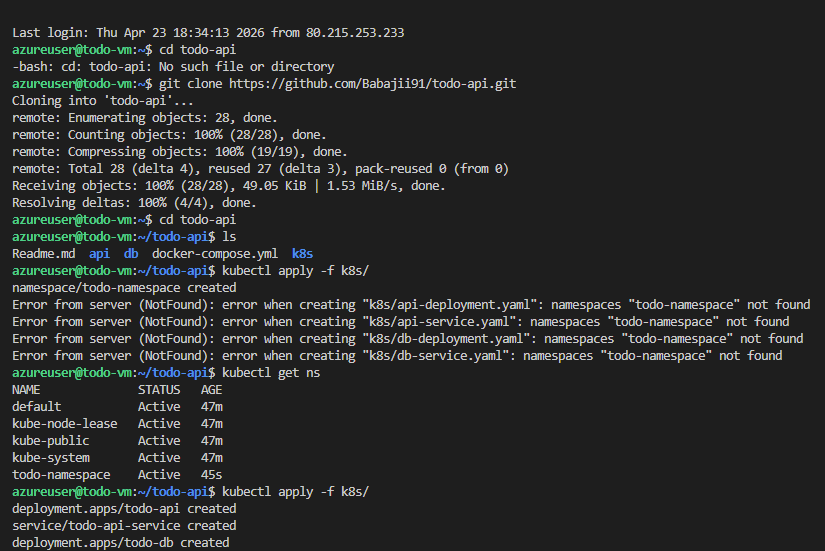

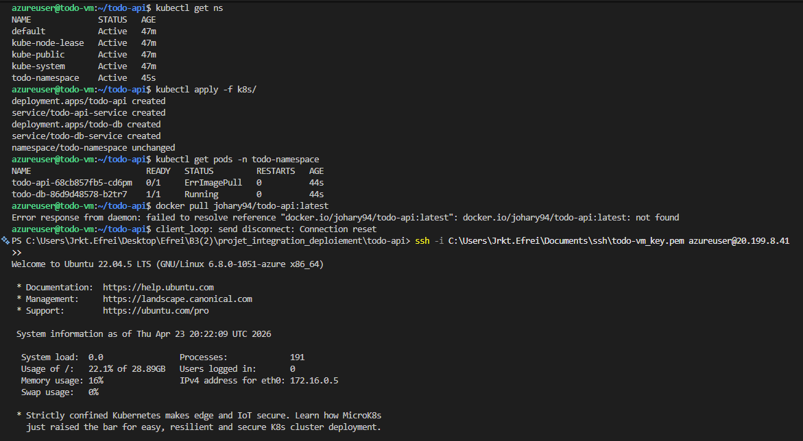

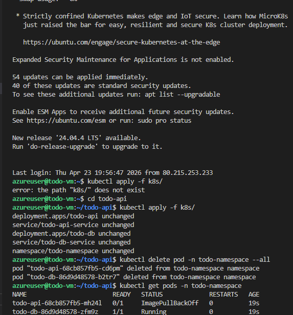

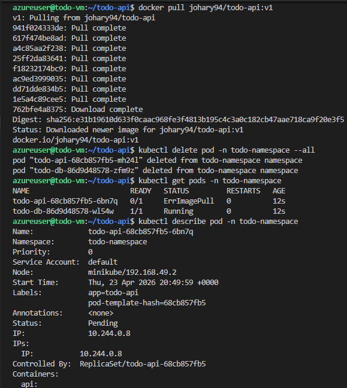

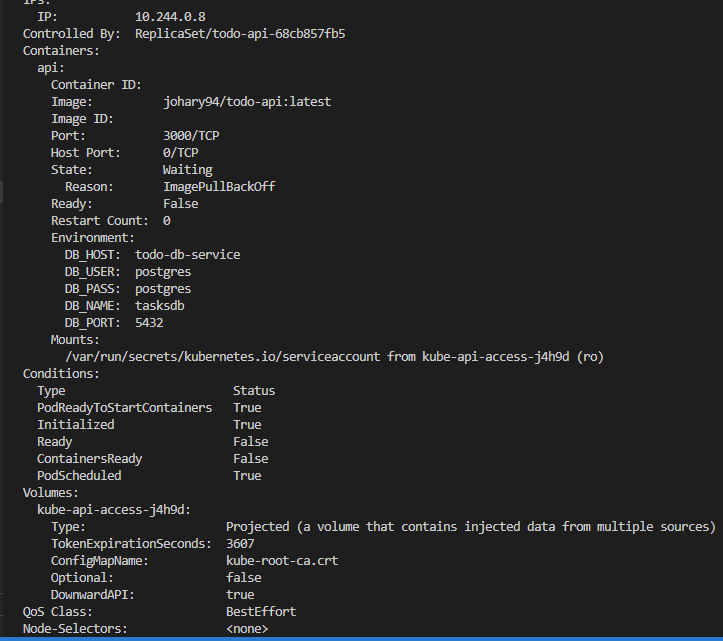

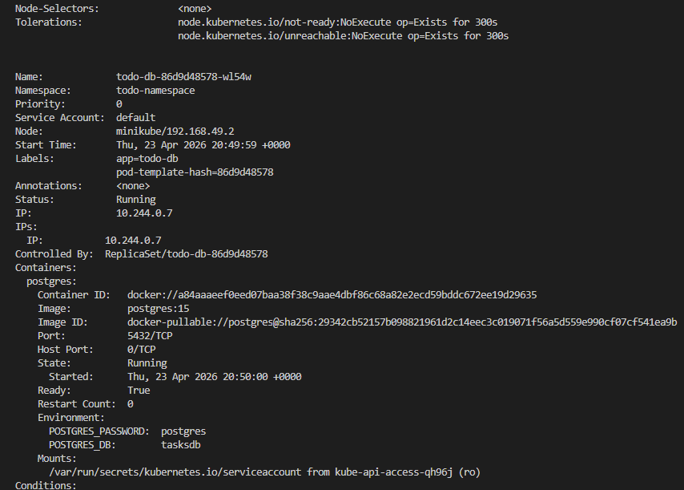

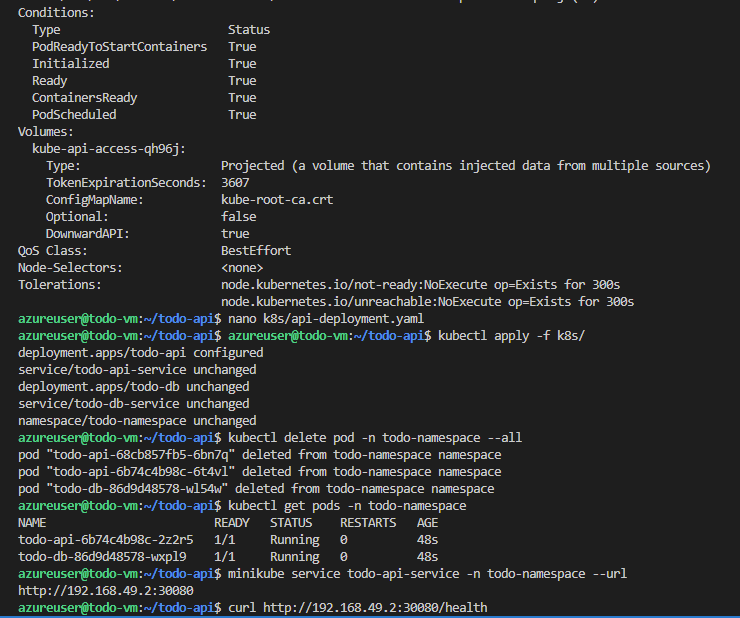

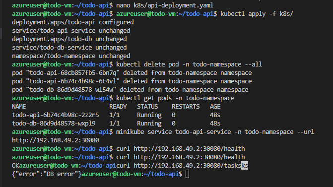


- J’ai déployé mon application dans un cluster Kubernetes installé dans ma VM Azure. 
Après avoir appliqué les manifests (Deployments, Services, Namespace), les pods 
étaient en état Running et l’API était accessible depuis l’intérieur du cluster via 
le NodePort 30080. La commande `curl http://192.168.49.2:30080/health` a confirmé 
que l’application fonctionnait correctement dans Kubernetes.

- J’ai ensuite configuré un service de type LoadBalancer. Minikube ne pouvant pas 
créer une IP publique dans Azure, l’adresse externe reste en état <pending>. 
L’utilisation de `minikube tunnel` permet de simuler un LoadBalancer local, mais 
ne rend pas l’application accessible via l’IP publique de la VM Azure.

- Ainsi, l’application tourne correctement dans le cluster Kubernetes, mais 
l’exposition via l’IP publique nécessite une configuration réseau supplémentaire 
ou un autre type d’orchestrateur (AKS, Nginx Ingress, ou un reverse proxy).

- La solution adaptée que je pourrais faire dans ce contexte consiste à installer un Ingress Controller 
(NGINX) dans Minikube. L’Ingress permet d’exposer l’application via le port 80 
de la VM, un port qui peut être ouvert dans le Network Security Group Azure. 
L’Ingress redirige ensuite le trafic HTTP vers le service Kubernetes interne 
(todo-api-service).

- Je me suis arrêté à cette étape.

### Pipeline CI/CD :


### Architecture du projet :


### 1. api/ — Service API Node.js
Contient tout le code du backend :

- **server.js** : point d’entrée de l’application  
- **package.json** : dépendances (Express, pg, Jest…)  
- **Dockerfile** : construction de l’image Docker  
- **tests/** : tests unitaires (healthcheck, endpoints…)  

---

### 2. db/ — Base de données PostgreSQL
Contient :

- **init.sql** : script SQL pour créer la table `tasks`  

Ce script est utilisé :
- automatiquement en local via Docker Compose  
- manuellement dans Kubernetes via `kubectl cp` + `psql -f`  

---

### 3. k8s/ — Déploiement Kubernetes
Contient tous les manifests YAML nécessaires au déploiement :

- **deployment-api.yaml** : déploiement de l’API  
- **service-api.yaml** : exposition via NodePort (30080)  
- **deployment-db.yaml** : déploiement PostgreSQL  
- **service-db.yaml** : service interne (ClusterIP)  
- **namespace.yaml** : namespace `todo-namespace`  

---

### 4. docker-compose.yml — Orchestration locale
Permet de lancer l’API + PostgreSQL en local :

```bash
docker-compose up --build

---
